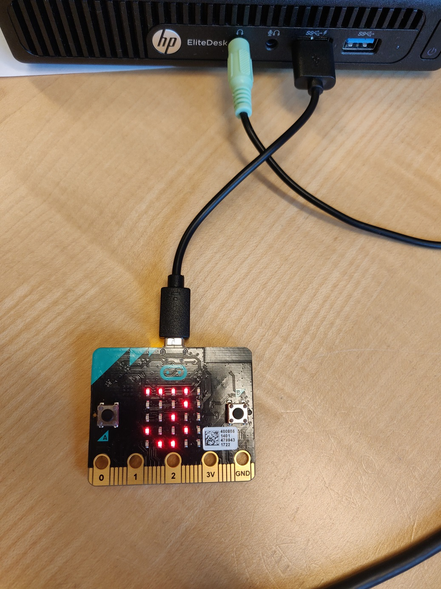
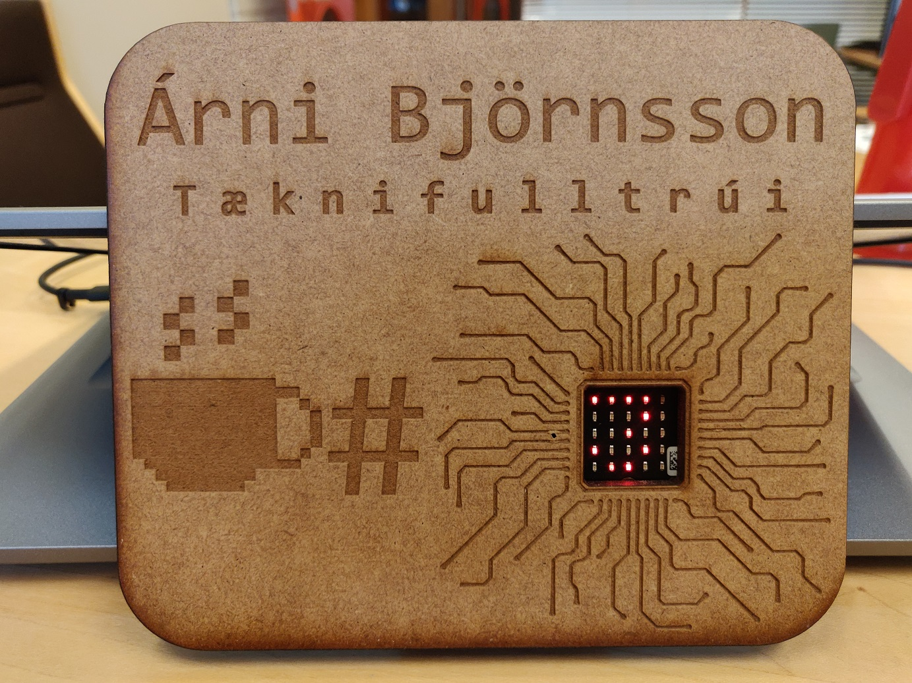

# Microbit Coffee Plaque

## Nameplaque for the office

Using a couple of Microbits and a laser-cut plaque, you can inform your co-workers on your coffee consumption. 

## Materials needed

- 2x Microbits (I used V1)
- 1x double AA battery holder for Microbit
- USB cable to flash

## Instructions

1. Flash one Microbit with the `reciever.py` and the other with `sender.py`. 
2. Using a pair of pliers, remove A & B buttons from reciever Microbit
3. Using a lasercutter (FabLab, yay!) cut your plaque. 
4. Center and glue your Microbit-reciever on the back. 
5. Glue your battery box on the back of the plaque
6. Power up!
7. Hit A to increase counter, B to reset counter. 

## Reminder

To increase battery life:
- The recivers display brightness is lowered
- It only checks for counter updates/resets every 30 minutes
- Remember to reset it at the end of the day, so the LED dont drain the batteries overnight. 

